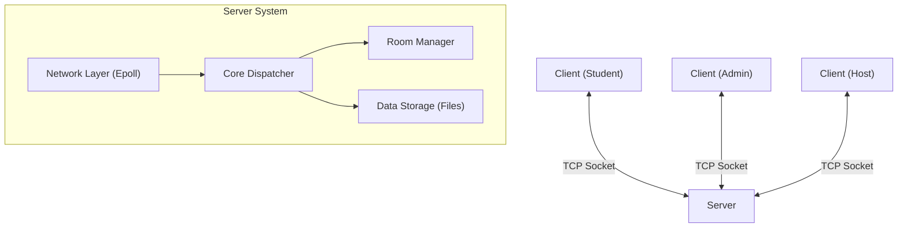

# BÁO CÁO BÀI TẬP LỚN: CÔNG NGHỆ PHẦN MỀM
## Đề tài: Ứng dụng thi trắc nghiệm trực tuyến (Quizzie)

---

# 1. Giới thiệu đề tài

### Tổng quan
Là hệ thống thi trắc nghiệm trực tuyến theo thời gian thực (Real-time), cho phép nhiều người dùng tham gia cùng lúc trong một phòng thi ảo.

### Mục tiêu
- **Tính tương tác**: Phản hồi tức thì giữa Host và Participants.
- **Hiệu năng cao**: Hỗ trợ nhiều kết nối đồng thời với độ trễ thấp.
- **Dễ sử dụng**: Giao diện trực quan cho cả Giảng viên (Admin) và Sinh viên.

### Các chức năng chính
- **Admin/Host**: Tạo phòng, tải ngân hàng câu hỏi, điều khiển tiến trình bài thi, xem thống kê.
- **Sinh viên**: Tham gia phòng, làm bài thi, xem kết quả cá nhân.
- **Luyện tập**: Chế độ tự ôn luyện với ngân hàng câu hỏi có sẵn.

---

# 2. Phân tích & Thiết kế hệ thống (Design before Code)

Phương pháp tiếp cận: **Thiết kế kiến trúc và giao diện trước khi cài đặt chi tiết.**

## 2.1. Kiến trúc tổng thể (High-Level Architecture)
Hệ thống tuân theo mô hình **Client-Server** truyền thống, sử dụng kết nối TCP để đảm bảo độ tin cậy.

## 2.2. Phân rã Functional Modules

### Client-side
- **UI Layer (GTK+3)**: Quản lý hiển thị và tương tác người dùng. Tách biệt logic UI và logic xử lý dữ liệu.
- **Network Manager**: Chịu trách nhiệm duy trì kết nối, gửi request và nhận response bất đồng bộ.
- **State Machine**: Quản lý trạng thái ứng dụng (Login -> Dashboard -> Room/Quiz).

### Server-side
- **Connection Manager**: Sử dụng `epoll` để theo dõi hàng nghìn file descriptions (socket) cùng lúc mà không tạo thread cho mỗi client.
- **Protocol Parser**: Phân tích cú pháp gói tin đầu vào.
- **Room Controller**: Logic nghiệp vụ cho phòng thi (join, leave, start, submit).
- **Storage Service**: Đọc/Ghi dữ liệu User, Log, Kết quả ra hệ thống file (Text/CSV).

## 2.3. Thiết kế luồng dữ liệu (Data Flow)
1. **Request**: User thao tác UI -> Client đóng gói message -> Server nhận qua Socket.
2. **Process**: Server parse message -> Router điều hướng đến Controller tương ứng (Auth, Quiz, Room).
3. **Response**: Server xử lý -> Cập nhật trạng thái Memory -> Gửi phản hồi cho Client(s).

---

# 3. Thiết kế giao thức tầng ứng dụng

Sử dụng giao thức hướng văn bản (Text-based Protocol) tùy biến, tối ưu cho sự đơn giản và dễ debug.

## Định dạng bản tin
- Cấu trúc: `TYPE:DATA\n`
- **TYPE**: Định danh loại lệnh (VD: `LOGIN`, `JOIN_ROOM`).
- **DATA**: Dữ liệu đi kèm, các trường phân tách bởi dấu phẩy hoặc ký tự đặc biệt.
- **Kết thúc gói**: Ký tự xuống dòng `\n` (Làm delimiter để xử lý fragmentation/coalescing của TCP).

## Danh sách lệnh chính
| Loại | Lệnh Request | Lệnh Response | Mô tả |
|------|-------------|---------------|-------|
| **Auth** | `LOGIN:u,p` | `LOGIN_SUCCESS:role` | Đăng nhập hệ thống |
| **Room** | `CREATE_ROOM:cfg` | `ROOM_CREATED:id` | Tạo phòng thi mới |
| **Room** | `JOIN_ROOM:id` | `JOIN_SUCCESS` | Tham gia phòng |
| **Quiz** | `START_GAME` | `QUESTIONS:...` | Bắt đầu bài thi |
| **Quiz** | `SUBMIT:ans` | `RESULT:score` | Nộp bài và nhận điểm |

---

# 4. Nền tảng & Thư viện xây dựng ứng dụng

### Môi trường phát triển
- **Hệ điều hành**: Linux (Ubuntu/CentOS) - Tận dụng tối đa các syscall mạnh mẽ như `epoll`.
- **Ngôn ngữ**: C (Logic xử lý hiệu năng cao), Makefile (Quản lý build).

### Thư viện & Công cụ
- **GTK+ 3.0**: Thư viện GUI toolkit chuẩn trên Linux để xây dựng giao diện Client đẹp và native.
- **POSIX Threads (pthread)**: Hỗ trợ đa luồng (cho Client UI background tasks).
- **POSIX Sockets API**: Giao tiếp mạng mức thấp.
- **Epoll (Linux specific)**: Cơ chế I/O event notification hiệu suất cao, thay thế cho `select()`/`poll()`.

---

# 5. Cơ chế kiểm soát nhiều máy khách (Server Concurrency)

Server được thiết kế theo mô hình **Event-driven Non-blocking I/O** để xử lý hàng nghìn kết nối đồng thời (C10k problem).

## Tại sao chọn Epoll?
- **Khả năng mở rộng**: Không giới hạn số lượng connection như `select`.
- **Hiệu năng**: Độ phức tạp O(1) khi monitor events, không cần duyệt toàn bộ danh sách socket.
- **Tài nguyên**: Không tốn chi phí context switch như mô hình "One Thread Per Client".

## Quy trình xử lý tại Server
1. **Init**: Tạo socket, set Non-blocking mode.
2. **Wait**: Gọi `epoll_wait()` để ngủ cho đến khi có sự kiện (VD: Client mới, Dữ liệu đến).
3. **Handle Events**:
   - Nếu là *Listening Socket*: `accept()` client mới -> Thêm vào danh sách theo dõi của Epoll.
   - Nếu là *Client Socket*: Đọc dữ liệu vào buffer riêng của client -> Kiểm tra ký tự `\n` -> Xử lý message -> Gửi phản hồi (nếu cần).
4. **Loop**: Quay lại bước Wait.

---

# 6. Kết quả xây dựng ứng dụng

## Minh họa giao diện

### 1. Màn hình Đăng nhập & Dashboard
*(Chèn ảnh màn hình Login và Menu chính tại đây)*
> Giao diện đăng nhập phân quyền Admin/Student, Dashboard hiển thị danh sách chức năng.

### 2. Danh sách phòng & Lobby
*(Chèn ảnh màn hình danh sách phòng chờ)*
> Hiển thị các phòng đang mở, trạng thái phòng, và danh sách người tham gia.

### 3. Giao diện làm bài thi (Quiz)
*(Chèn ảnh màn hình câu hỏi trắc nghiệm)*
> Hiển thị câu hỏi, các phương án lựa chọn, và đồng hồ đếm ngược.

### 4. Kết quả & Thống kê
*(Chèn ảnh màn hình bảng điểm)*
> Hiển thị điểm số ngay sau khi nộp bài, Admin xem được thống kê tổng quát của cả phòng.

---

# 7. Phân công công việc

| Thành viên | Nhiệm vụ chính | Chi tiết module |
|------------|----------------|-----------------|
| **[Tên 1]** | Client UI & UX | Thiết kế giao diện GTK, xử lý sự kiện UI (`client/ui`) |
| **[Tên 2]** | Client Logic | Xử lý logic nghiệp vụ phía client, ghép nối Network (`client/core`) |
| **[Tên 3]** | Server Network | Xây dựng lõi Server, Epoll loop, Socket handling (`server/net`) |
| **[Tên 4]** | Server Business | Xử lý logic phòng thi, chấm điểm, lưu trữ dữ liệu (`server/room`) |
| **[Tên 5]** | Protocol & Test | Thiết kế giao thức, viết test case, tài liệu báo cáo |

---

# Cảm ơn Thầy/Cô và các bạn đã lắng nghe!
*Nhóm sinh viên thực hiện*
