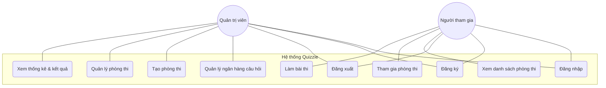

# Sơ đồ Usecase - Hệ thống Quizzie

Hệ thống Quizzie bao gồm hai nhóm người dùng chính là **Quản trị viên (Admin)** và **Người tham gia (Participant)**. Cả hai đều kế thừa các chức năng cơ bản của một người dùng hệ thống.

## Danh sách các Actor và Usecase

### 1. Actors
- **Người dùng (User)**: Người dùng cơ bản của hệ thống.
- **Quản trị viên (Admin)**: Người tổ chức cuộc thi, quản lý câu hỏi và phòng thi.
- **Người tham gia (Participant)**: Người tham gia trả lời các câu hỏi trong phòng thi.

### 2. Các Usecase chính

#### Nhóm Hệ thống & Tài khoản
- **Đăng ký/Đăng nhập/Đăng xuất**: Quản lý phiên làm việc của người dùng.

#### Nhóm Quản trị (Admin)
- **Quản lý ngân hàng câu hỏi**: Cho phép Admin xem, thêm (qua CSV), sửa hoặc xóa các bộ câu hỏi.
- **Tạo phòng thi**: Thiết lập thông số cho một cuộc thi mới (tên, thời gian, số câu hỏi).
- **Quản lý phòng thi**: Xem trạng thái, đóng hoặc xóa các phòng thi đang tồn tại.
- **Xem thống kê**: Theo dõi kết quả thi của các thí sinh trong thời gian thực hoặc sau khi kết thúc.

#### Nhóm Tham gia (Participant)
- **Xem danh sách phòng**: Tìm kiếm các phòng thi đang mở (Open).
- **Tham gia phòng thi**: Vào một phòng thi cụ thể để chuẩn bị làm bài.
- **Làm bài thi**: Trả lời từng câu hỏi, hệ thống tự động lưu đáp án và nộp bài khi hoàn thành hoặc hết giờ.
