# Quizzie - Hệ thống Thi Trắc Nghiệm Trực Tuyến

## TCP Connection State Machine

Hệ thống sử dụng cơ chế kết nối TCP bền vững (Persistent Connection) kết hợp với Header nhị phân và Payload JSON. Dưới đây là mô hình trạng thái kết nối ở hai phía:

### 1. Phía Server (State Machine)

Server quản lý client thông qua socket và định danh người dùng sau khi đăng nhập thành công:

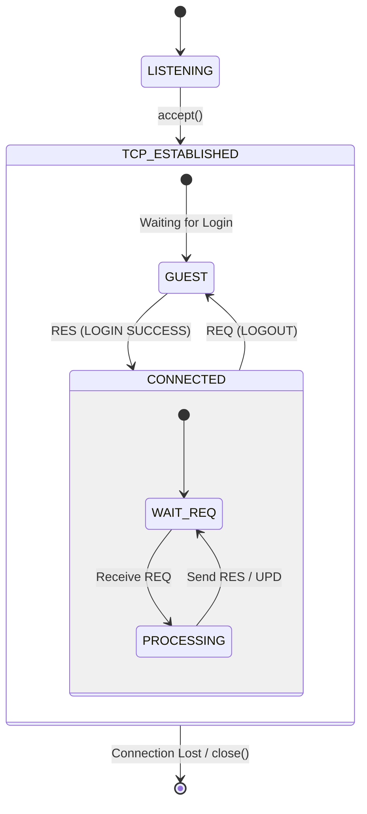

---

### 2. Phía Client (State Machine)

Ở phía Client, trạng thái `CONNECTED` đại diện cho việc phiên làm việc đã được thiết lập thành công:

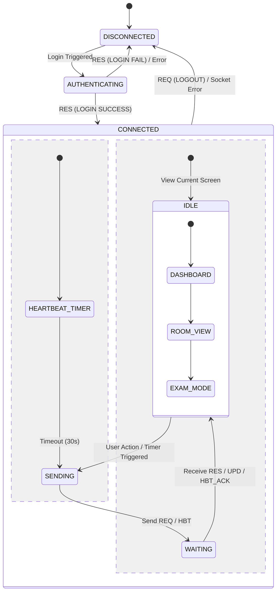

**Đặc điểm Client:**
- **ensure_connection()**: Hàm này đảm bảo socket luôn sẵn sàng trước khi gửi dữ liệu. Nếu mất kết nối, nó sẽ thử tạo lại socket.
- **DASHBOARD_VIEW**: Màn hình chính sau khi đăng nhập, hiển thị danh sách các phòng thi khả dụng.
- **EXAM_VIEW**: Màn hình làm bài thi với đồng hồ đếm ngược và cơ chế gửi đáp án tức thời (Immediate Feedback).

---

### 3. Cơ chế Heartbeat & Xử lý Ngoại lệ

Để đảm bảo tính thời gian thực và độ tin cậy, hệ thống triển khai cơ chế Heartbeat (HBT) và các kịch bản xử lý lỗi kết nối.

#### 3.1. Luồng Heartbeat (Keep-alive)
Cơ chế này giúp Server nhận biết Client còn hoạt động hay không và ngược lại, tránh việc giữ các tài nguyên "treo".

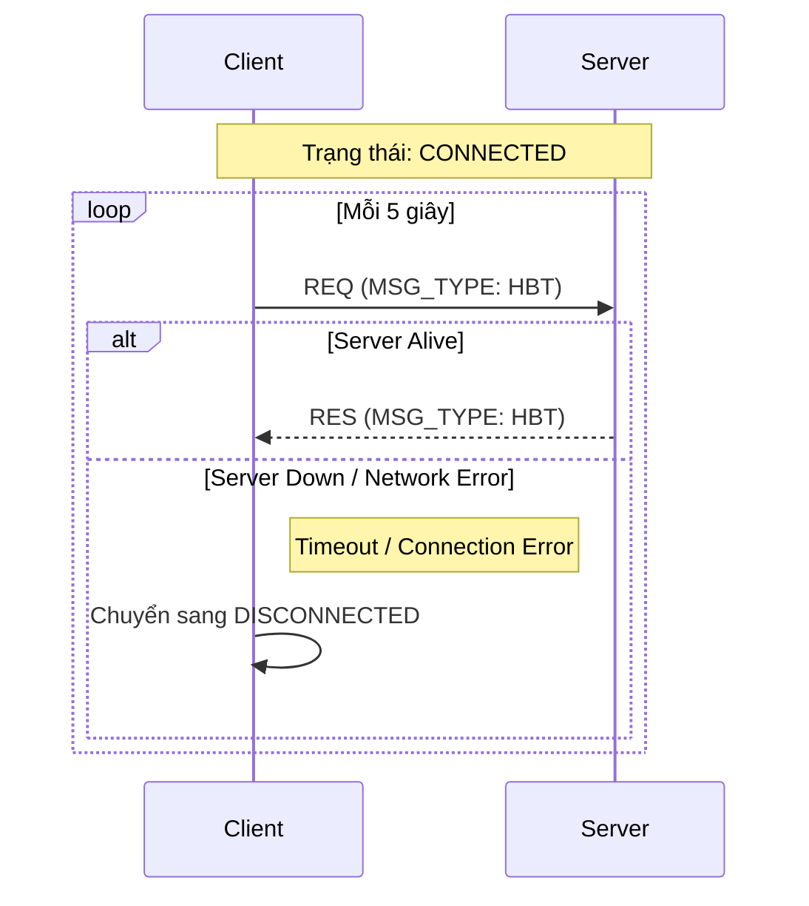

#### 3.2. Xử lý Ngắt kết nối & Rejoin
Khi một kết nối bị ngắt đột ngột (mất mạng, crash), hệ thống xử lý như sau:

**Phía Server:**
1. **Phát hiện**: `poll()` trả về sự kiện lỗi hoặc `recv()` trả về 0.
2. **Xử lý**:
   - Đóng socket, gọi `client_remove()` để giải phóng tài nguyên.
   - **Quan trọng**: Nếu client đang trong `TESTING`, Server KHÔNG xóa phiên thi (`ExamSession`) mà giữ lại trong bộ nhớ tạm/file.
3. **Timeout**: Nếu sau một khoảng thời gian (ví dụ 5 phút) client không quay lại, phiên thi mới chính thức bị hủy.

**Phía Client:**
1. **Phát hiện**: Gửi/Nhận tin nhắn thất bại.
2. **Xử lý**:
   - Hiển thị thông báo mất kết nối.
   - Gọi `ensure_connection()` để thử tạo lại socket TCP.
   - Gửi yêu cầu `LOGIN` lại.
   - Sau khi login, nếu có phiên thi cũ, Server sẽ gửi lại trạng thái bài thi (`UPD`) để Client khôi phục `EXAM_MODE`.

#### 3.3. Sơ đồ Xử lý Ngoại lệ (Exception Handling)

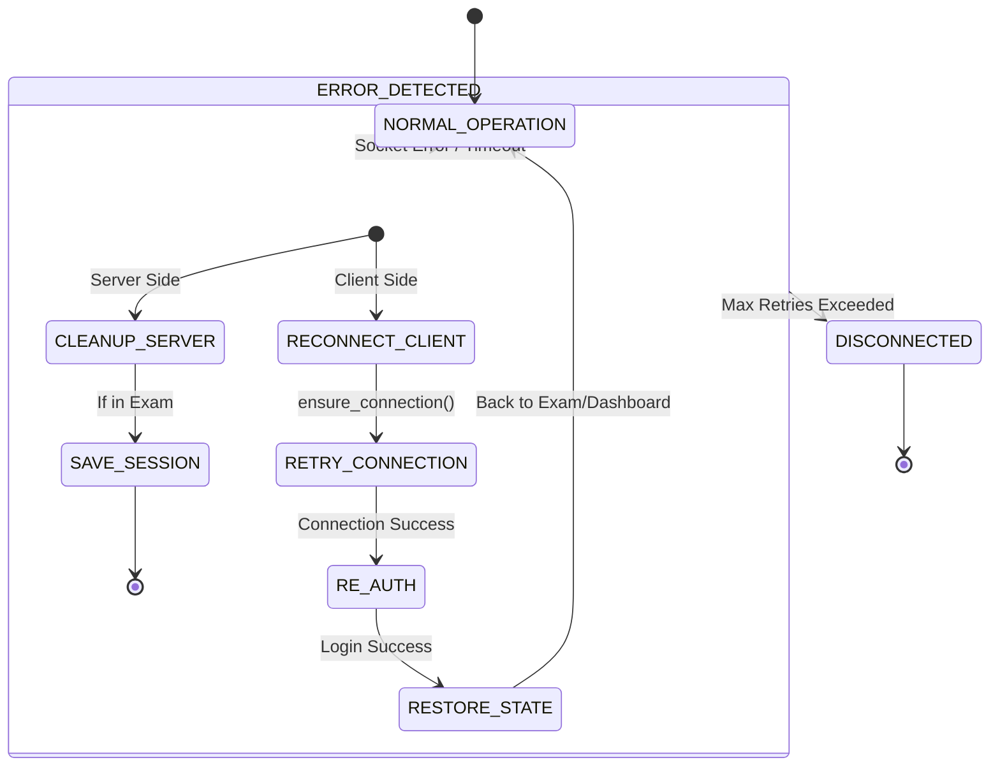

---

### 4. Các Luồng Nghiệp vụ Chính (Sequence Diagrams)

Dưới đây là các luồng tương tác chính giữa Client và Server dựa trên đặc tả SRS.

#### 4.1. Đăng nhập (Authentication)
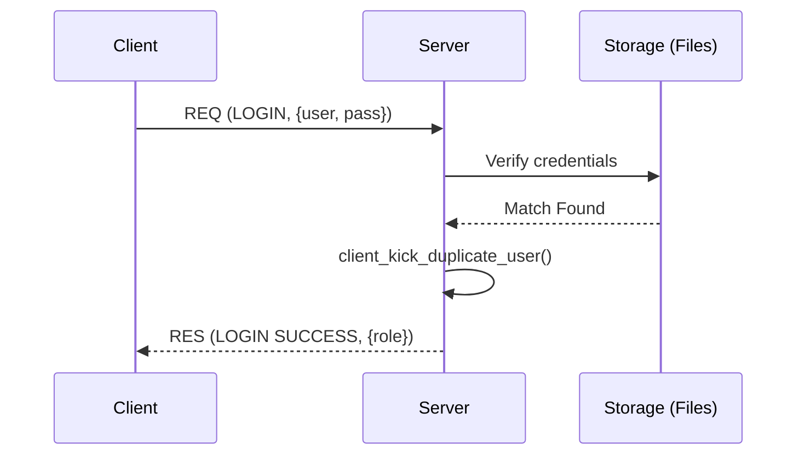

#### 4.2. Quản lý Phòng thi (Admin Flow)
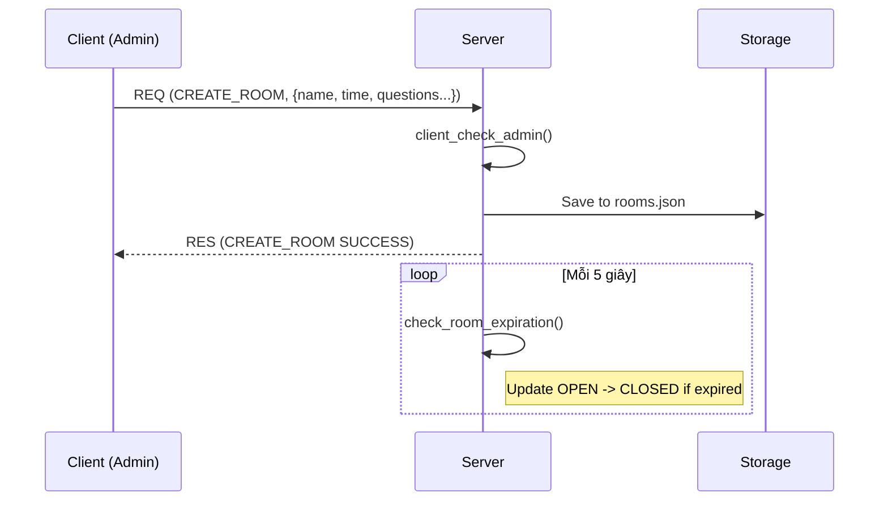

#### 4.3. Luồng Thi & Nộp bài (Participant Flow)
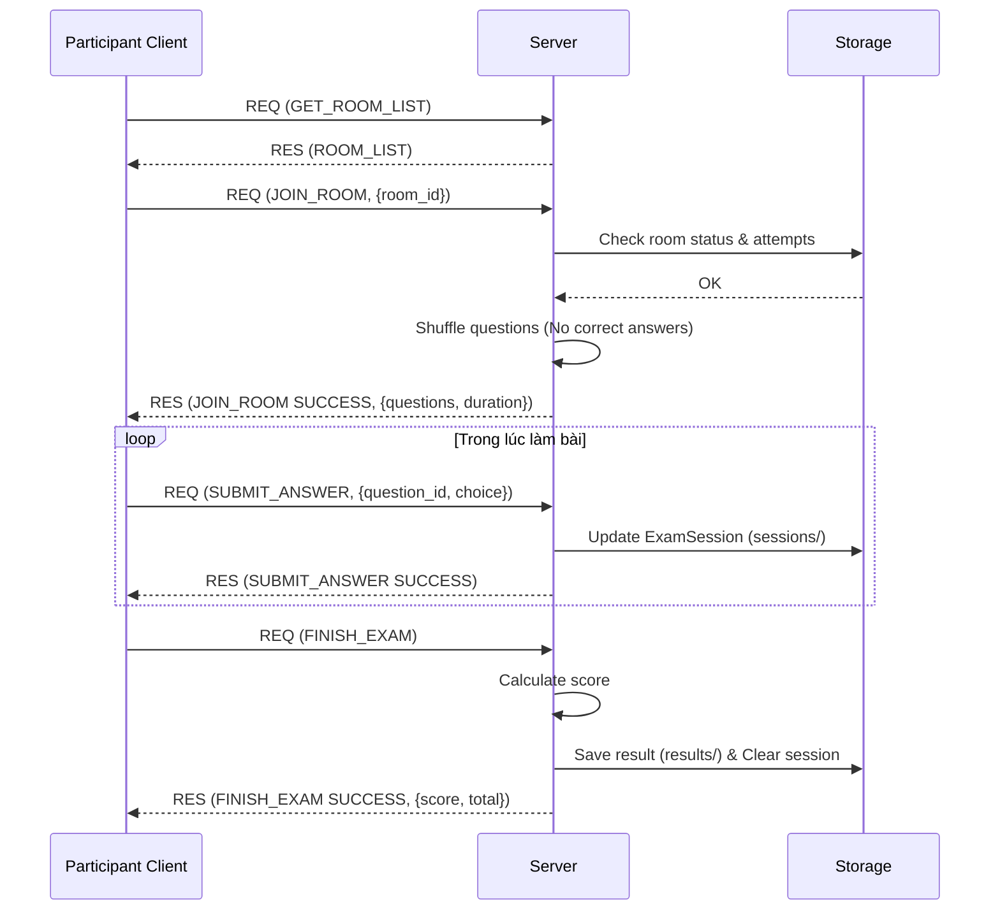

#### 4.4. Khôi phục phiên thi (Rejoin Persistence)
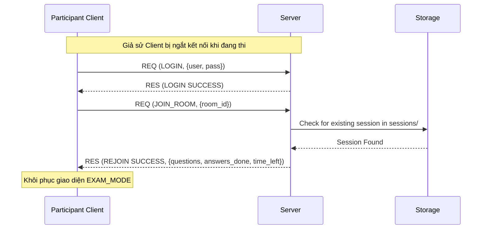

#### 4.5. Quản lý Câu hỏi (Question CRUD)
Hệ thống cho phép Admin quản lý toàn diện các ngân hàng câu hỏi thông qua giao diện biên tập trực quan.

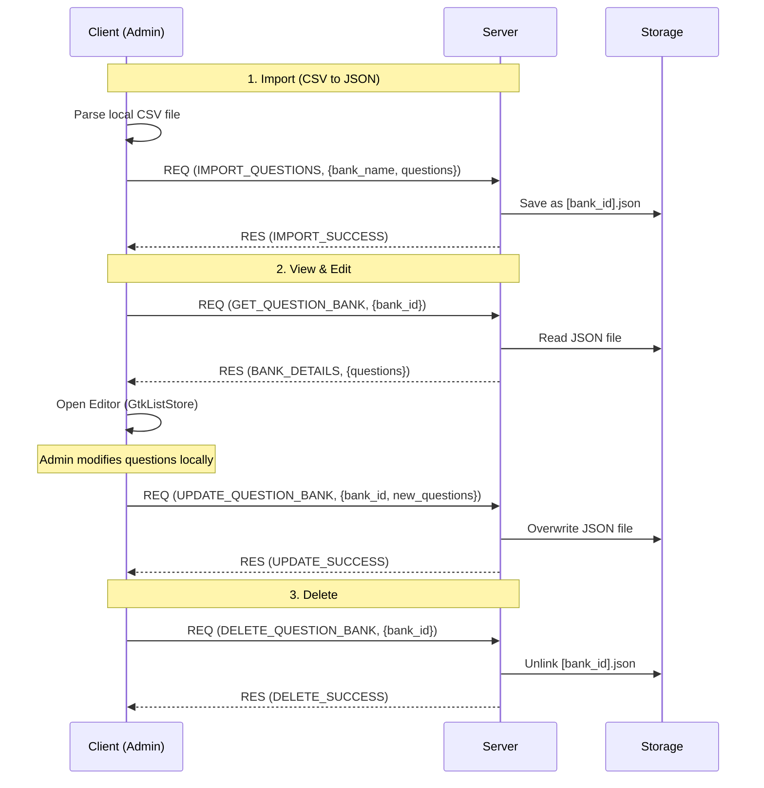

**Đặc điểm thiết kế:**
- **Client-side Parsing**: Server không xử lý file CSV, Client chịu trách nhiệm chuyển đổi sang JSON để giảm tải cho Server.
- **Full State Update**: Khi chỉnh sửa, Client gửi toàn bộ mảng câu hỏi mới để ghi đè, giúp logic đồng bộ đơn giản và tin cậy.
- **Permission**: Mọi yêu cầu đều được kiểm tra `client_check_admin()` trước khi thực thi.

---

### 5. Giao thức Giao tiếp (Packet Structure)

Mọi trạng thái chuyển đổi đều dựa trên việc trao đổi các gói tin theo định dạng:

| Trường | Kích thước | Mô tả |
| :--- | :--- | :--- |
| **TotalLength** | 4 Bytes | `uint32_t` (Big-endian), tổng độ dài gói |
| **MSG_TYPE** | 3 Bytes | `REQ`, `RES`, `ERR`, `UPD`, `HBT` |
| **Payload** | N Bytes | Dữ liệu JSON (Thông tin đăng nhập, câu hỏi, đáp án...) |

---

### 6. Luồng Tương Tác Người Dùng (User Interaction Flow)

Dựa trên cấu trúc UI của Client (GTK-based), hệ thống có các màn hình và luồng tương tác sau:

#### 6.1. Tổng quan các Màn hình UI

| Màn hình | File nguồn | Mô tả |
| :--- | :--- | :--- |
| **Login Screen** | `ui_login.c` | Màn hình đăng nhập/đăng ký, kết nối server |
| **Home Screen** | `ui_home.c` | Danh sách phòng thi cho Participant |
| **Admin Dashboard** | `ui_admin.c` | Quản lý phòng thi và ngân hàng câu hỏi |
| **Room Detail** | `ui_room_detail.c` | Chi tiết phòng thi và lịch sử làm bài |
| **Exam Screen** | `ui_exam.c` | Giao diện làm bài thi với đồng hồ đếm ngược |

---

#### 6.2. Chi tiết các Màn hình

##### 6.2.1. Login Screen (Màn hình Đăng nhập)

**Thành phần giao diện:**
- **Trường nhập liệu:**
  - IP Address: Địa chỉ IP của server
  - Port: Cổng kết nối
  - Username: Tên đăng nhập
  - Password: Mật khẩu (ẩn ký tự)
- **Nút bấm:**
  - "Đăng nhập": Xác thực tài khoản
  - "Đăng ký": Tạo tài khoản mới
- **Nhãn trạng thái:** Hiển thị trạng thái kết nối (Connected/Disconnected)

**Bố cục:** Sử dụng `GtkGrid` căn giữa màn hình, các thành phần xếp theo hàng.

---

##### 6.2.2. Home Screen (Màn hình chính - Thí sinh)

**Thành phần giao diện:**
- **Header:**
  - Nhãn chào mừng với tên người dùng
  - Nút "Đăng xuất"
- **Bảng danh sách phòng thi:** (`GtkTreeView`)
  - Cột: Mã phòng | Tên phòng | Trạng thái | Thời gian mở | Thời lượng
- **Nút bấm:**
  - "Làm mới": Cập nhật danh sách phòng
  - "Xem chi tiết": Mở màn hình Room Detail
- **Nhãn trạng thái:** Hiển thị trạng thái kết nối

**Bố cục:** `GtkBox` dọc - Header → Bảng phòng thi (có scroll) → Nút hành động → Trạng thái.

---

##### 6.2.3. Admin Dashboard (Bảng điều khiển Quản trị)

**Thành phần giao diện:**
- **Header:**
  - Nhãn chào mừng Admin
  - Nút "Đăng xuất"
- **Thanh công cụ:**
  - "Tạo phòng mới": Mở dialog tạo phòng
  - "Quản lý đề thi": Mở trình quản lý ngân hàng câu hỏi
  - "Làm mới": Cập nhật danh sách
  - "Chi tiết": Xem thống kê phòng thi
- **Bảng danh sách phòng:** (`GtkTreeView`)
  - Cột: ID | Tên | Trạng thái | Thời gian mở/đóng | Số câu hỏi | Số lượt thi

**Chức năng chính:**
- Quản lý phòng thi: Tạo, đóng, xóa phòng
- Quản lý ngân hàng câu hỏi: Import CSV, chỉnh sửa, xóa
- Xem thống kê: Kết quả thi, điểm trung bình

---

##### 6.2.4. Room Detail Screen (Màn hình Chi tiết Phòng thi)

**Thành phần giao diện:**
- **Thông tin phòng:** (`GtkGrid`)
  - Mã phòng, Tên phòng, Trạng thái
  - Thời gian bắt đầu/kết thúc
  - Số câu hỏi, Số lượt thi cho phép, Thời lượng
- **Bảng lịch sử làm bài:** (`GtkTreeView`)
  - Cột: Ngày giờ | Số câu | Đã nộp | Số câu đúng
- **Nút bấm:**
  - "Quay lại": Về Home Screen
  - "Bắt đầu" / "Tiếp tục làm": Vào phòng thi
  - "Xem lại bài đã chọn": Xem đáp án đã chọn (nếu được phép)

**Bố cục:** `GtkBox` dọc - Tiêu đề → Grid thông tin → Separator → Lịch sử → Nút hành động.

---

##### 6.2.5. Exam Screen (Màn hình Làm bài thi)

**Thành phần giao diện:**
- **Thanh trên:**
  - Đồng hồ đếm ngược (định dạng MM:SS)
  - Hướng dẫn làm bài
- **Vùng câu hỏi:** (Scrollable container)
  - Các block câu hỏi được tạo động
  - Mỗi câu gồm: Nội dung câu hỏi + 4 `GtkRadioButton` (A, B, C, D)
- **Thanh dưới:**
  - "Thoát": Lưu tiến độ và thoát (có thể quay lại)
  - "Nộp bài": Kết thúc bài thi

**Chức năng đặc biệt:**
- **Lưu tự động:** Mỗi khi chọn đáp án, tự động gửi lên server
- **Tự động nộp:** Khi hết giờ, hệ thống tự động nộp bài
- **Phân biệt Thoát/Nộp:** "Thoát" cho phép quay lại làm tiếp, "Nộp bài" kết thúc hoàn toàn

---

#### 6.3. Luồng Chính - Phân nhánh theo Role

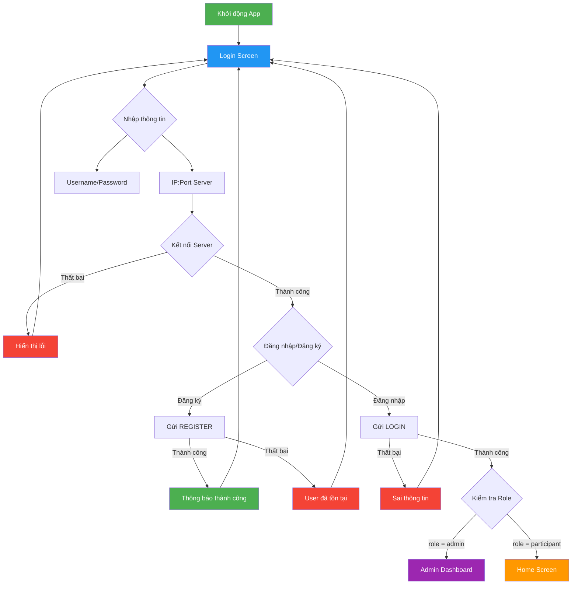

#### 6.4. Luồng Participant (Thí sinh)

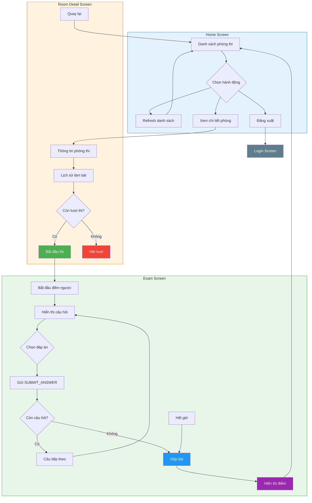

#### 6.5. Luồng Admin (Quản trị viên)

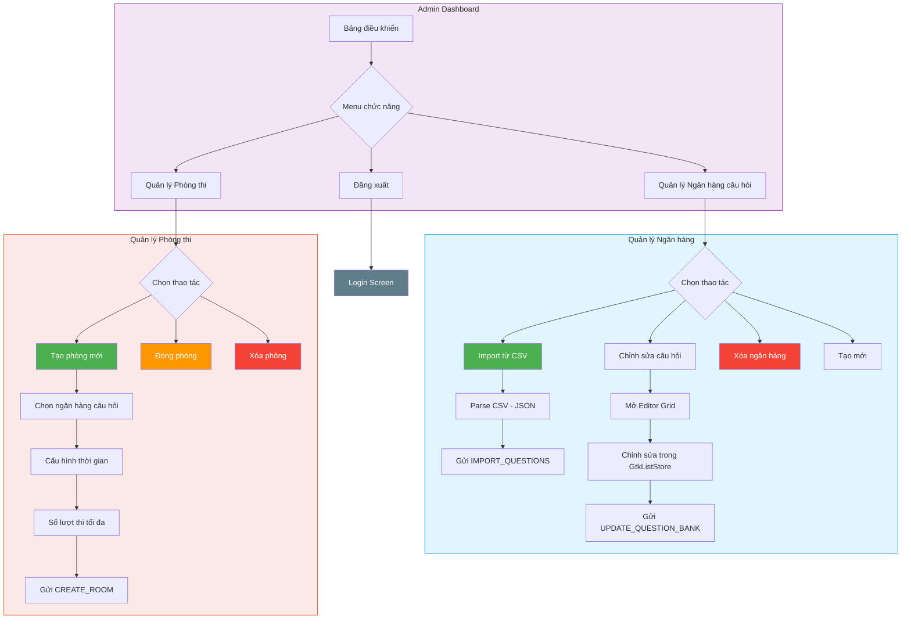

#### 6.6. Luồng Chi tiết - Làm bài thi

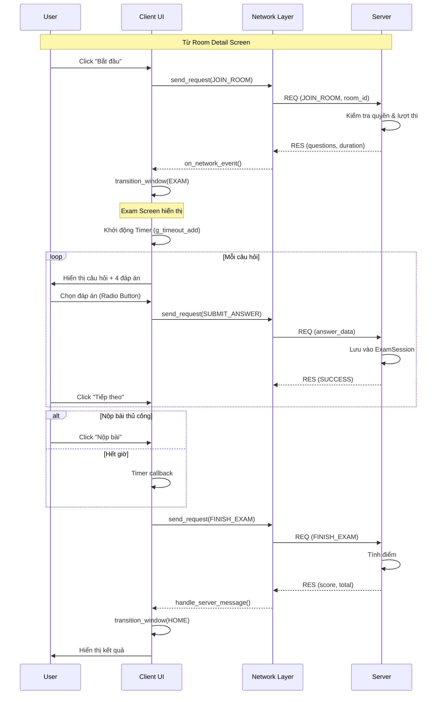

#### 6.7. Cơ chế Chuyển màn hình (Window Transition)

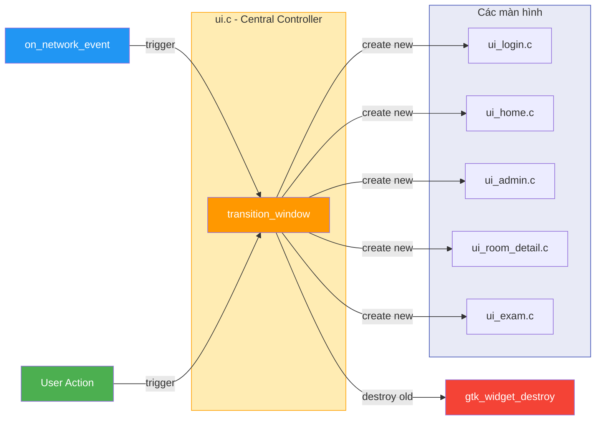

**Đặc điểm kỹ thuật:**
- **GTK Main Loop**: `gtk_main()` xử lý tất cả sự kiện UI và timer
- **Network Integration**: Callback `on_network_event` được gọi khi có message từ server
- **State Management**: Trạng thái UI được quản lý thông qua global variables và GTK widgets
- **Timer**: `g_timeout_add()` được sử dụng cho đồng hồ đếm ngược trong Exam Screen
